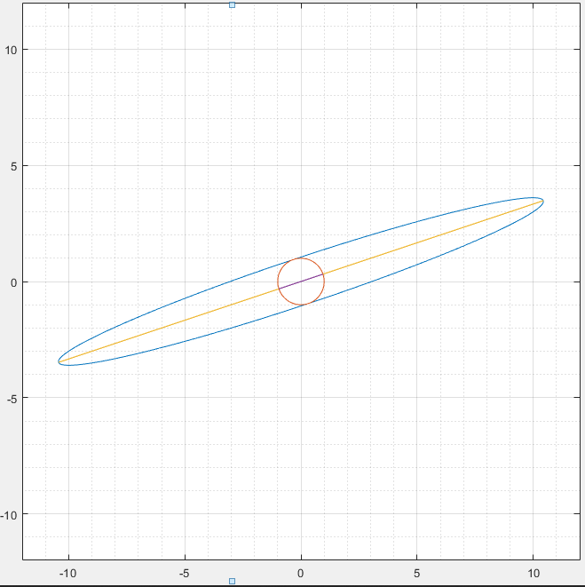

# Eigenvectors-and-eigenvalues-of-matrices-with-elements-real-numbers
MATLAB
searched for eigenvectors and numbers of matrices two by two, made sure that our program found eigenvalues and eigenvectors correctly, except for complex ones, because it does not provide such functionality. All data found by the program coincide with the data found analytically. He also made sure that the product of eigenvalues is equal to the determinant of the matrix.

